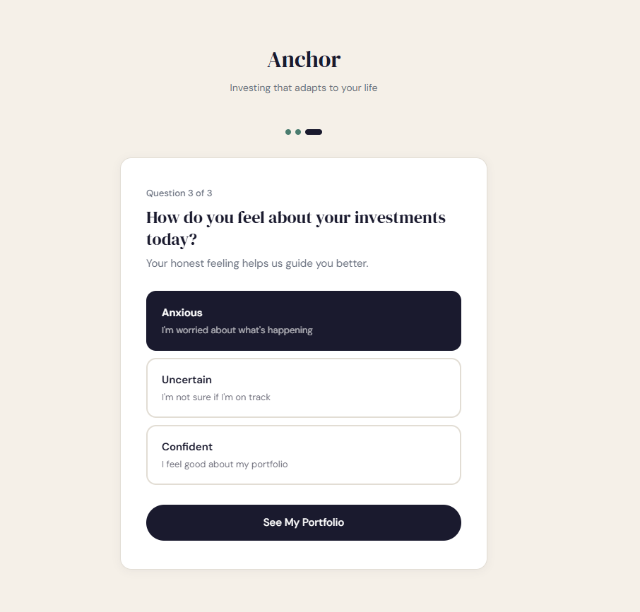
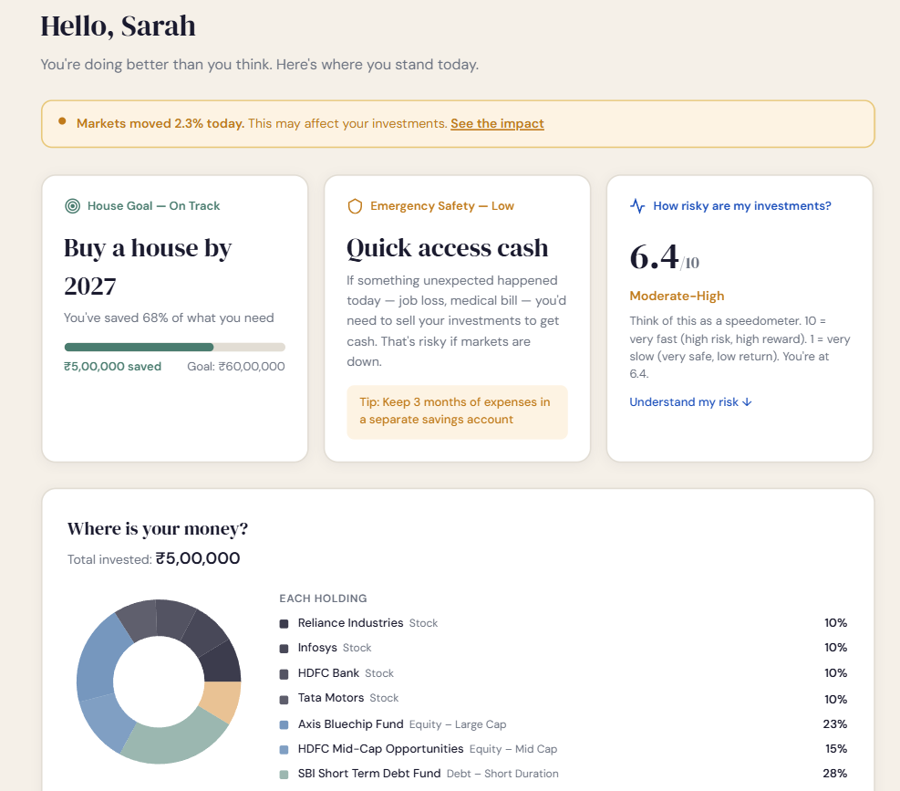
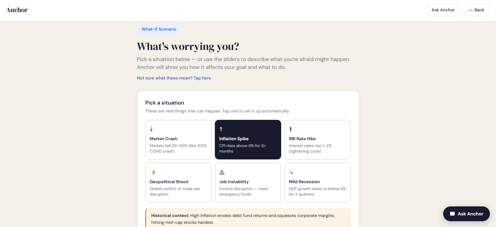
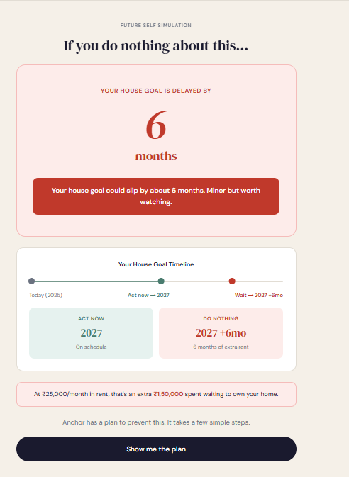
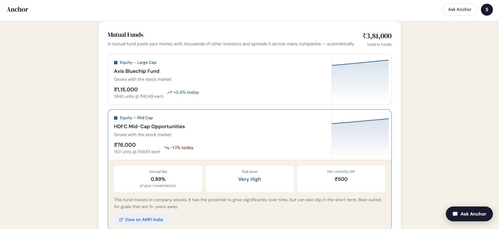
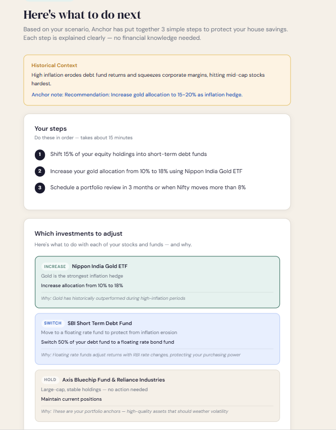

# Anchor — Portfolio Management for First-Time Investors

> Built for the Goldman Sachs Hackathon 2025 · *Investing that adapts to your life, not just the market.*

Anchor is a life-aware, AI-powered portfolio management system designed for people who want to invest but find traditional platforms overwhelming. Instead of charts and jargon, Anchor speaks plain English — telling you whether you're on track for your goals and what to do when markets get scary.

---

## Screenshots

| Onboarding | Dashboard |
|---|---|
|  |  |

| Scenario Engine | Future Self Simulation |
|---|---|
|  |  |

| Stock Holdings | Action Plan |
|---|---|
|  |  |

---

## The Problem

Most investment platforms are built for professionals — cluttered with jargon like Alpha, Beta, and Sharpe ratios. When markets fall, first-time investors panic, make bad decisions, and lose money. They don't need more data. They need clarity, context, and calm.

**Beginners don't quit investing because of losses. They quit because of confusion and fear.**

---

## The Solution

Anchor reframes investing around life events, emotions, and future consequences — not abstract financial metrics.

It answers the questions real people actually ask:

- *"Am I still on track to buy my house?"*
- *"What happens to my savings if markets crash?"*
- *"What should I do — and why?"*

---

## Key Features

### Life-First Onboarding
Three conversational questions replace complex risk questionnaires. Users pick their actual goal (house, education, retirement), their worry level, and their emotional state. The entire app personalises around their answers.

### Intuitive Dashboard
- Portfolio translated into plain English — no jargon
- Two pie charts: Stocks vs Mutual Funds split, and individual holdings breakdown
- Expandable stock cards with projected growth charts and live Yahoo Finance links
- Expandable mutual fund cards with plain-English explanations
- Plain-language attention cards instead of opaque risk metrics

### What-If Scenario Engine
Users can simulate market crashes, inflation spikes, rate hikes, geopolitical shocks, job loss, and recession. Sliders show real-time impact previews. Six macro scenario presets auto-configure everything.

### Future Self Simulation *(Signature Feature)*
After running a scenario, Anchor shows:

> *"If you do nothing, your house goal is delayed by 14 months. That's 14 more months of rent."*

A timeline visualization shows exactly when the user reaches their goal if they act now vs. if they wait.

### Recommendation Engine
- Colour-coded action cards: **Reduce / Increase / Switch / Hold / Withdraw first**
- Visual before/after pie charts
- Estimated tax and exit fee costs in plain tiles
- Confidence score (0–100%) for the plan

### Radical Transparency
Every recommendation includes three clickable explanations — why, what it costs, and what happens if ignored. Toggle **"Explain Like I'm 15"** mode for even simpler language.

### AI Portfolio Chatbot
Powered by GPT-4o Mini with full portfolio context. The chatbot knows the user's exact holdings, goal, risk score, and fund details — giving specific, relevant answers.

---

## Tech Stack

| Layer | Technology |
|---|---|
| Frontend | React 18 + Vite |
| Styling | Tailwind CSS + custom CSS variables |
| Charts | Recharts (area charts, pie charts) |
| AI Chatbot | OpenAI GPT-4o Mini API |
| Fonts | DM Serif Display + DM Sans (Google Fonts) |
| Data | Rule-based scenario engine + simulated portfolio |
| Live links | Yahoo Finance (stocks) + AMFI India (mutual funds) |

---

## Architecture

```
src/
├── data/
│   └── mockData.js           # Portfolio data, scenario engine, risk logic, chatbot context
├── pages/
│   ├── Onboarding.jsx        # Goal selection + preference questions
│   ├── Dashboard.jsx         # Main portfolio view
│   ├── Scenario.jsx          # What-If scenario builder
│   ├── FutureSelf.jsx        # Future Self Simulation
│   └── Recommendation.jsx   # Action plan + transparency panel
├── components/
│   └── Chatbot.jsx           # AI portfolio assistant
├── App.jsx                   # Router + global state
└── index.css                 # Design tokens + component styles
```

### Scenario Logic

```
If market drop ≥ 10%  → shift 10% out of equity
If market drop ≥ 20%  → shift additional 8%
If cash need ≥ 20%    → shift additional 8% + flag liquidity action
If emotion = anxious  → shift additional 3% + add safety buffer step

Goal delay (months) = (marketDrop × 0.35) + (cashNeed × 0.25)
Confidence score    = 90 − penalties for scenario severity
```

---

## Running Locally

```bash
# Clone the repository
git clone https://github.com/YOUR_USERNAME/anchor-portfolio-app.git
cd anchor-portfolio-app

# Install dependencies
npm install

# Add your OpenAI API key
# Create a .env file in the root folder:
VITE_OPENAI_KEY=your-openai-key-here

# Start the development server
npm run dev

# Open http://localhost:5173
```

The app runs fully without an API key — only the chatbot requires it. All scenario logic, charts, and recommendations are client-side.

---

## Design Decisions

**Rule-based logic over ML** — Explainability matters more than accuracy for a trust-first product. Every recommendation traces to a specific threshold, which is exactly what the Radical Transparency panel shows users.

**Simulated data over real APIs** — Real-time NSE/BSE APIs require broker partnerships. The portfolio uses real tickers linked to live Yahoo Finance pages and real AMFI-registered fund names.

**Plain English everywhere** — Financial jargon is a barrier, not a feature. Every label was rewritten to remove terms a non-investor would have to look up.

---

## Hackathon Context

**Challenge:** Goldman Sachs — *Navigating the Unknown: Intuitive Portfolio Management & Dynamic Rebalancing for the Everyday Investor*

| Criteria | Approach |
|---|---|
| UX & Empathy (30%) | Life-first language, emotion-aware nudges, goal-based onboarding |
| Innovation in Rebalancing (30%) | Future Self Simulation, macro scenarios, specific fund/stock actions |
| Transparency & Trust (20%) | Three-panel explanation system, ELI15 mode, full cost breakdown |
| Technical Execution (20%) | Working React prototype, rule-based engine, GPT-4o Mini chatbot |

---

## License

MIT — see LICENSE file.
Built by Manaswini Gupta
